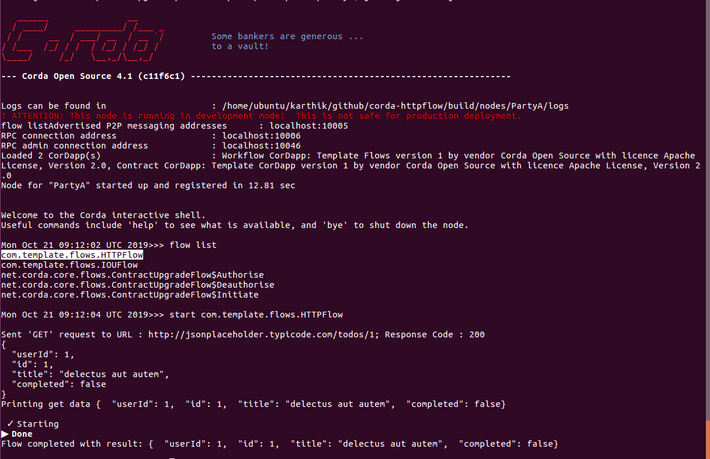

  

# CorDapp Template - Kotlin

Welcome to the Kotlin CorDapp template. The CorDapp template is a stubbed-out CorDapp that you can use to bootstrap 
your own CorDapps.

**This is the Kotlin version of the CorDapp template. The Java equivalent is 
[here](https://github.com/corda/cordapp-template-java/).**

# Pre-Requisites

See https://docs.corda.net/getting-set-up.html.

# Usage

## Running tests inside IntelliJ

We recommend editing your IntelliJ preferences so that you use the Gradle runner - this means that the quasar utils
plugin will make sure that some flags (like ``-javaagent`` - see below) are
set for you.

To switch to using the Gradle runner:

* Navigate to ``Build, Execution, Deployment -> Build Tools -> Gradle -> Runner`` (or search for `runner`)
  * Windows: this is in "Settings"
  * MacOS: this is in "Preferences"
* Set "Delegate IDE build/run actions to gradle" to true
* Set "Run test using:" to "Gradle Test Runner"

If you would prefer to use the built in IntelliJ JUnit test runner, you can run ``gradlew installQuasar`` which will
copy your quasar JAR file to the lib directory. You will then need to specify ``-javaagent:lib/quasar.jar``
and set the run directory to the project root directory for each test.

## Running the nodes

See https://docs.corda.net/tutorial-cordapp.html#running-the-example-cordapp.

## Interacting with the node (Call http flow)

